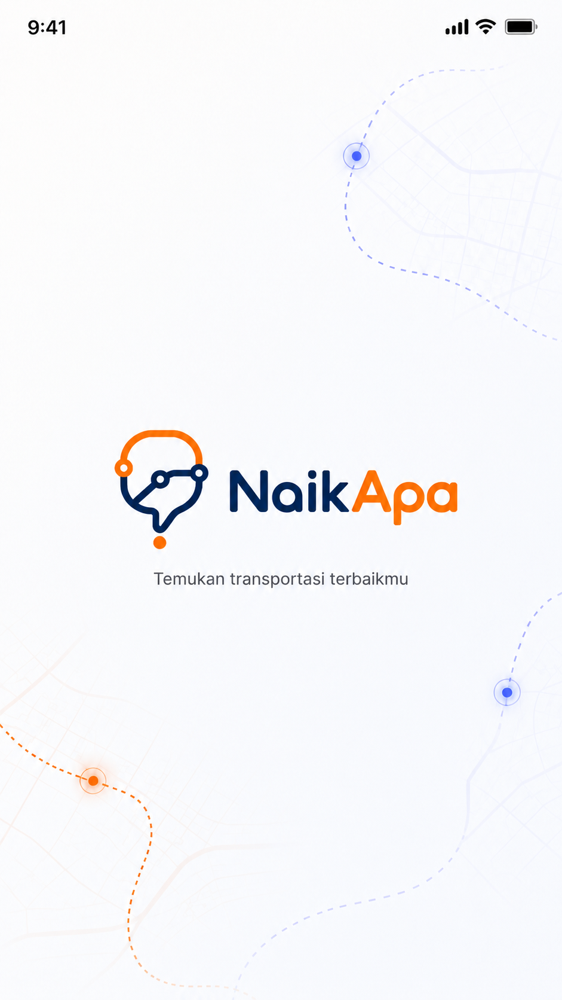
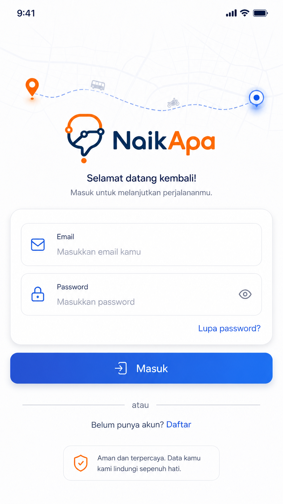
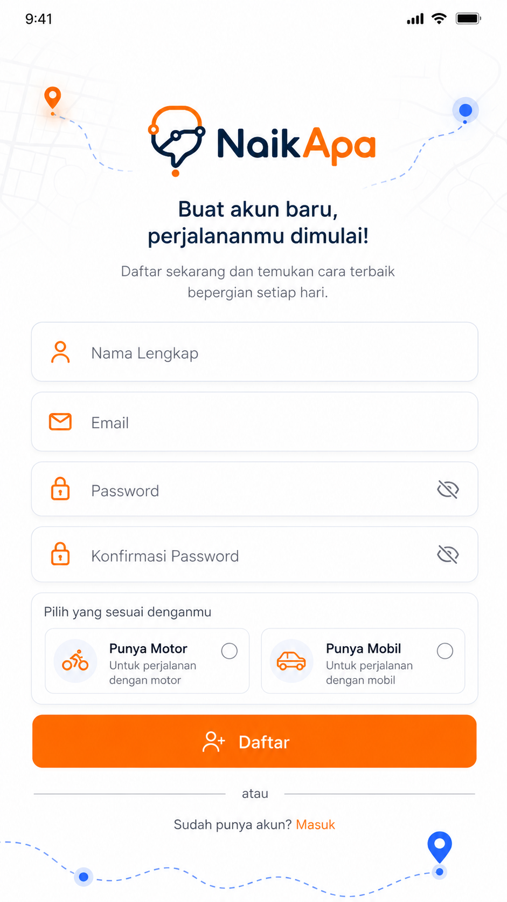
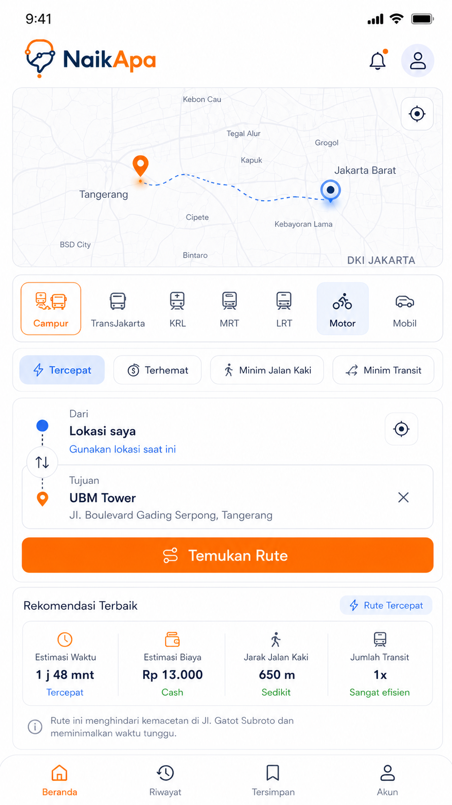

<div align="center">


# NaikApa

### Aplikasi Rekomendasi Transportasi Multimoda Jabodetabek

[](https://developer.android.com)
[](https://kotlinlang.org)
[-blue?style=flat-square)](https://developer.android.com/about/versions/oreo)
[](https://developer.android.com)
[](#)

> **"Bukan sekadar cek rute — NaikApa memberi tahu kamu sebaiknya naik apa."**

</div>

---

## 📖 Tentang Aplikasi

**NaikApa** adalah aplikasi Android native yang membantu pengguna di wilayah **Jabodetabek** menentukan pilihan transportasi paling sesuai berdasarkan kondisi perjalanan mereka. Berbeda dari aplikasi navigasi biasa, NaikApa tidak hanya menampilkan jalur — ia memberikan **rekomendasi cerdas** lengkap dengan skor kecocokan, alasan pemilihan, estimasi biaya, dan peringatan gangguan aktif.

Aplikasi ini dikembangkan sebagai proyek tugas **Pemrograman Mobile** menggunakan Android native Kotlin, dengan data GTFS nyata dari TransJakarta, KRL, MRT, dan LRT Jabodebek.

---

## ✨ Fitur Utama

<table>
<tr>
<td width="50%">

### 🗺️ Rekomendasi Rute Multimoda
- Rekomendasi utama + 2 alternatif
- Skor kecocokan 0–100
- Alasan rekomendasi dalam Bahasa Indonesia
- Dukungan rute transit, kendaraan pribadi, dan **gabungan** (motor/mobil ke stasiun → transit)

### 🚌 Transportasi Umum (GTFS)
- TransJakarta (semua koridor)
- KRL Commuter Line Jabodetabek
- MRT Jakarta
- LRT Jakarta & LRT Jabodebek
- Algoritma **Dijkstra Multimodal** dengan walking transfer otomatis

</td>
<td width="50%">

### 🚗 Kendaraan Pribadi
- Rute motor & mobil via **TomTom Routing API**
- Estimasi BBM berdasarkan jarak
- Opsi hindari tol (mobil)

### ⚠️ Laporan Gangguan
- Laporan dari pengguna (crowdsourced)
- Aktif selama 1 jam, memberi penalti ringan ke rute
- CRUD lengkap dengan foto dari kamera/galeri

### 📍 Fitur Lainnya
- Pencarian lokasi via **TomTom Search API** + GTFS lokal
- Peta interaktif dengan **osmdroid** (CartoDB tiles)
- Riwayat pencarian & perjalanan
- Perjalanan favorit (saved trips)
- Profil pengguna dengan preferensi kendaraan

</td>
</tr>
</table>

---

## 📸 Tampilan Aplikasi

<div align="center">
<table>
<tr>
<td align="center"><br/><sub><b>Splash Screen</b></sub></td>
<td align="center"><br/><sub><b>Login</b></sub></td>
<td align="center"><br/><sub><b>Register</b></sub></td>
<td align="center"><br/><sub><b>Home & Rekomendasi</b></sub></td>
</tr>
</table>
</div>

---

## 🏗️ Arsitektur

Proyek mengikuti pola **layered architecture** (Data → Domain → Presentation):

```
app/src/main/java/com/example/naikapa/
│
├── common/                     # Konstanta, session, view extensions
│   ├── AppConstants.kt
│   ├── SessionManager.kt
│   └── ViewExtensions.kt
│
├── data/
│   ├── local/                  # SQLite DAO & database helper
│   │   ├── GtfsDao.kt
│   │   ├── HistoryDao.kt
│   │   ├── DisruptionReportDao.kt
│   │   ├── SavedTripDao.kt
│   │   └── NaikApaDatabaseHelper.kt
│   ├── model/                  # Data class & sealed class
│   │   ├── RecommendationModels.kt
│   │   ├── TransitRouteModels.kt
│   │   ├── CombinedRouteModels.kt
│   │   └── ...
│   ├── remote/                 # Retrofit API client
│   │   ├── TomTomSearchApi.kt
│   │   └── TomTomRoutingApi.kt
│   └── repository/             # Repository pattern
│       ├── TransitRoutingRepository.kt
│       ├── CombinedRouteRepository.kt
│       └── TomTomRoutingRepository.kt
│
├── domain/
│   ├── recommendation/         # Engine rekomendasi & scoring
│   │   ├── RecommendationEngine.kt
│   │   ├── RecommendationScorer.kt
│   │   └── RecommendationReasonBuilder.kt
│   └── routing/                # Algoritma routing
│       ├── DijkstraAlgorithm.kt
│       ├── TransitGraphBuilder.kt
│       ├── WalkingTransferBuilder.kt
│       ├── FareCalculator.kt
│       └── GeoDistanceCalculator.kt
│
└── presentation/
    ├── splash/                 # SplashActivity
    ├── auth/                   # Login & Register
    ├── home/                   # Home + RouteResultAdapter
    ├── route_detail/           # Detail rute + timeline steps
    ├── history/                # Riwayat pencarian & perjalanan
    ├── report/                 # Laporan gangguan (CRUD + foto)
    └── profile/                # Profil pengguna
```

---

## 🧠 Algoritma Rekomendasi

### Dijkstra Multimodal

Graf berarah berbobot dibangun dari data GTFS di memori. Node adalah halte/stasiun, edge adalah koneksi antar halte dalam rute yang sama. **Walking transfer** dibuat otomatis antar halte dari agensi berbeda dalam radius ≤ 350 meter menggunakan formula Haversine.

### Sistem Scoring

Setiap kandidat rute diberi skor 0–100 berdasarkan prioritas yang dipilih pengguna:

| Prioritas | Waktu | Biaya | Jalan Kaki | Transit | Gangguan |
|-----------|-------|-------|------------|---------|----------|
| ⚡ Tercepat | **45%** | 15% | 15% | 15% | 10% |
| 💰 Terhemat | 20% | **45%** | 15% | 10% | 10% |
| 🚶 Minim Jalan Kaki | 20% | 15% | **45%** | 10% | 10% |
| 🔄 Minim Transit | 20% | 15% | 10% | **45%** | 10% |

Laporan gangguan aktif memberikan penalti **-15 poin** pada rute terdampak.

### Rute Gabungan (Park & Ride)

Sistem secara otomatis menghitung skenario kendaraan pribadi → transit:
1. Cari titik GTFS terdekat dari lokasi pengguna (radius 8 km)
2. Hitung rute kendaraan pribadi ke titik tersebut via TomTom
3. Hitung rute transit dari titik GTFS awal ke tujuan via Dijkstra
4. Gabungkan semua segmen dan hitung metrik total

---

## 🗄️ Database

Aplikasi menggunakan **SQLite native** dengan dua database:

### `naikapa_gtfs.db` (Pre-built, ~bundled as asset)
Data GTFS yang sudah diproses dari 4 operator transit:

| Tabel | Isi |
|-------|-----|
| `gtfs_stops` | ~8.000+ halte & stasiun |
| `gtfs_routes` | Semua rute/koridor |
| `gtfs_trips` | Trip per rute |
| `gtfs_stop_times` | Jadwal kedatangan/keberangkatan |

### `naikapa.db` (User data)

| Tabel | Isi |
|-------|-----|
| `users` | Akun pengguna lokal |
| `user_profiles` | Preferensi & data tambahan |
| `saved_trips` | Perjalanan favorit |
| `search_history` | Riwayat pencarian lokasi |
| `route_history` | Riwayat rekomendasi rute |
| `disruption_reports` | Laporan gangguan pengguna |
| `route_cache` | Cache hasil rute (opsional) |

---

## 🛠️ Tech Stack

| Kategori | Library / Tool | Versi |
|----------|---------------|-------|
| **Language** | Kotlin | — |
| **UI** | Material Design 3, ViewBinding | 1.14.0 |
| **Navigation** | Jetpack Navigation Component | 2.7.7 |
| **Maps** | osmdroid (OpenStreetMap) | 6.1.18 |
| **Map Tiles** | CartoDB Positron & Dark Matter | — |
| **Location** | Google Play Services Location | 21.3.0 |
| **HTTP Client** | Retrofit + OkHttp | 2.11.0 / 4.12.0 |
| **Image Loading** | Glide | 4.16.0 |
| **Async** | Kotlin Coroutines | 1.8.1 |
| **Database** | SQLite native | — |
| **Search API** | TomTom Search REST API | — |
| **Routing API** | TomTom Routing REST API | — |
| **Testing** | JUnit 4, Mockito, Espresso | — |

---

## 🚀 Cara Menjalankan

### Prasyarat

- Android Studio Hedgehog atau lebih baru
- JDK 11+
- Android device / emulator dengan API 26+
- TomTom API Key (gratis di [developer.tomtom.com](https://developer.tomtom.com))

### Setup

1. **Clone repository**
   ```bash
   git clone https://github.com/username/NaikApa.git
   cd NaikApa
   ```

2. **Tambahkan API Key**

   Buat file `local.properties` di root project (jika belum ada) dan tambahkan:
   ```properties
   TOMTOM_API_KEY=your_api_key_here
   ```

3. **Build & Run**
   ```bash
   ./gradlew assembleDebug
   ```
   Atau langsung jalankan dari Android Studio dengan menekan tombol **Run ▶**.

### Catatan

- File database GTFS (`naikapa_gtfs.db`) sudah dibundel di `app/src/main/assets/databases/`.
- Saat pertama kali dijalankan, database akan disalin otomatis ke internal storage perangkat.
- Fitur peta dan pencarian lokasi membutuhkan koneksi internet.
- Fitur transit (Dijkstra) dan data lokal bekerja secara offline.

---

## 📊 Data Transit

Data GTFS yang digunakan berasal dari sumber resmi dan data custom tervalidasi:

| Operator | Agency ID | Cakupan | Tarif |
|----------|-----------|---------|-------|
| **TransJakarta** | `Tije` | Semua koridor BRT DKI Jakarta | Flat Rp 3.500 |
| **KRL Commuter Line** | `KAIC` | Jalur Bogor, Cikarang, Rangkasbitung, Tangerang, Tanjung Priok | Progresif (Rp 3.000 + Rp 1.000/10km) |
| **MRT Jakarta** | `MRTJ` | Lebak Bulus – Bundaran HI | Rp 3.000 + Rp 1.000/stasiun (maks Rp 14.000) |
| **LRT Jakarta** | `LRTJ` | Kelapa Gading – Velodrome | Flat Rp 5.000 |
| **LRT Jabodebek** | `LRTJB` | Dukuh Atas – Bekasi Timur / Jatimulya | Rp 5.000 + Rp 700/km (maks Rp 20.000) |

---

## 📁 Struktur Direktori

```
NaikApa/
├── app/
│   └── src/
│       ├── main/
│       │   ├── assets/databases/   # Pre-built GTFS SQLite database
│       │   ├── java/               # Source code Kotlin
│       │   └── res/                # Layout, drawable, values
│       ├── test/                   # Unit tests
│       └── androidTest/            # Instrumented tests
├── data/
│   ├── gtfs/                       # Raw GTFS TransJakarta
│   ├── gtfs-krl/                   # Raw GTFS KRL
│   ├── gtfs-mrt/                   # Raw GTFS MRT
│   └── gtfs-lrt/                   # Raw GTFS LRT
├── konsep/                         # Dokumen PRD & konsep teknis
├── references/                     # Aset logo & referensi UI
├── scripts/
│   ├── build_gtfs_db.py            # Script build database GTFS
│   └── validate_gtfs_db.py         # Script validasi database
└── README.md
```

---

## 🔐 Izin Aplikasi

| Izin | Kegunaan |
|------|----------|
| `ACCESS_FINE_LOCATION` | Mengambil lokasi GPS pengguna |
| `ACCESS_COARSE_LOCATION` | Fallback lokasi kasar |
| `INTERNET` | TomTom API & tile peta |
| `CAMERA` | Foto laporan gangguan |
| `READ_MEDIA_IMAGES` | Pilih foto dari galeri |
| `WRITE_EXTERNAL_STORAGE` | Simpan foto laporan (API < 29) |

---

## 🗺️ Alur Pengguna Utama

```
Buka App
    │
    ▼
Splash Screen ──► Sudah login? ──► Home
                       │
                       ▼ (belum)
                    Login / Register
                       │
                       ▼
                     Home
                  ┌────┴────┐
                  │         │
              Pilih Moda  Pilih Prioritas
                  │
                  ▼
           Input Asal (GPS) + Tujuan (TomTom Search)
                  │
                  ▼
           Hitung Rute (Dijkstra + TomTom + Scoring)
                  │
                  ▼
        Rekomendasi Utama + 2 Alternatif
                  │
                  ▼
           Detail Rute + Peta + Timeline
                  │
            ┌─────┴─────┐
            │           │
        Simpan       Buat Laporan
        Favorit       Gangguan
```

---

## 🧪 Testing

```bash
# Unit tests
./gradlew testDebugUnitTest

# Instrumented tests (butuh device/emulator)
./gradlew connectedAndroidTest

# Lint check
./gradlew lintDebug

# Build debug APK
./gradlew assembleDebug
```

---

## 📝 Catatan Pengembangan

- Aplikasi ini dikembangkan untuk keperluan **akademik** (tugas Pemrograman Mobile).
- API key TomTom disimpan di `local.properties` dan tidak di-commit ke repository.
- Data KRL menggunakan model **headway** (bukan jadwal eksak per trip) karena keterbatasan data publik.
- Login & register bersifat **lokal** (SQLite), bukan autentikasi cloud.
- Laporan gangguan aktif selama **1 jam** dan hanya memberi penalti ringan, tidak memblokir rute.

---

## 👤 Developer

Dikembangkan sebagai proyek tugas Pemrograman Mobile — Android Native Kotlin.

---

<div align="center">

**NaikApa** — *Karena perjalanan yang baik dimulai dari keputusan yang tepat.*


</div>
